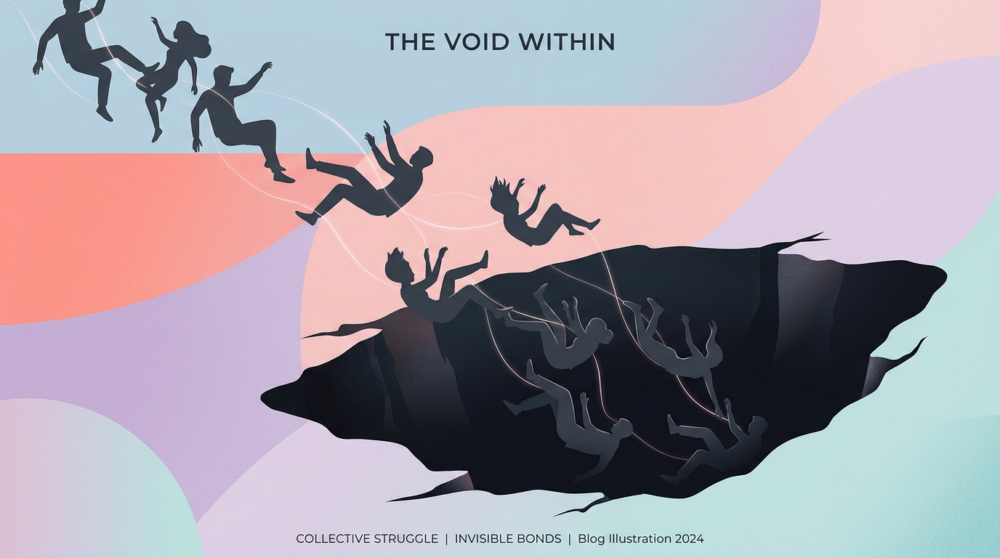
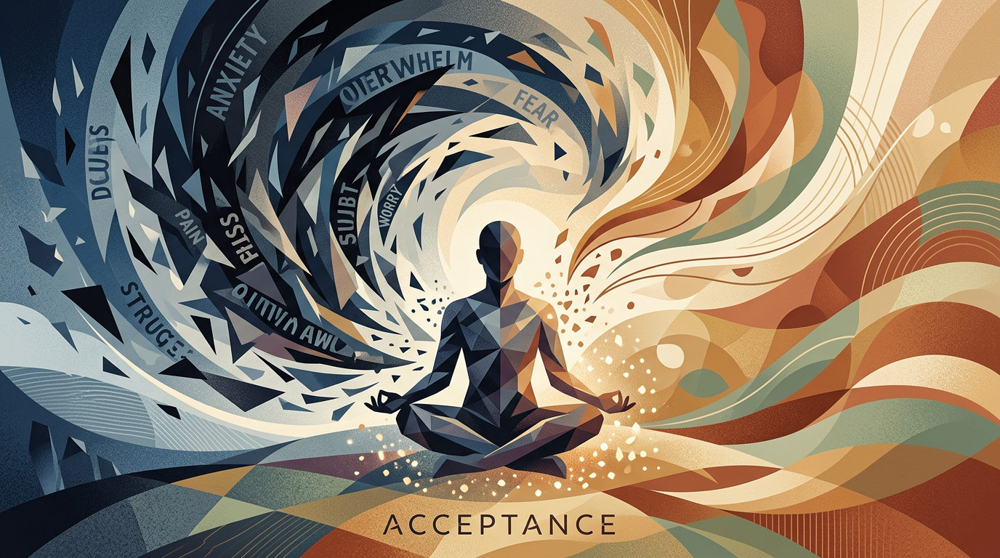
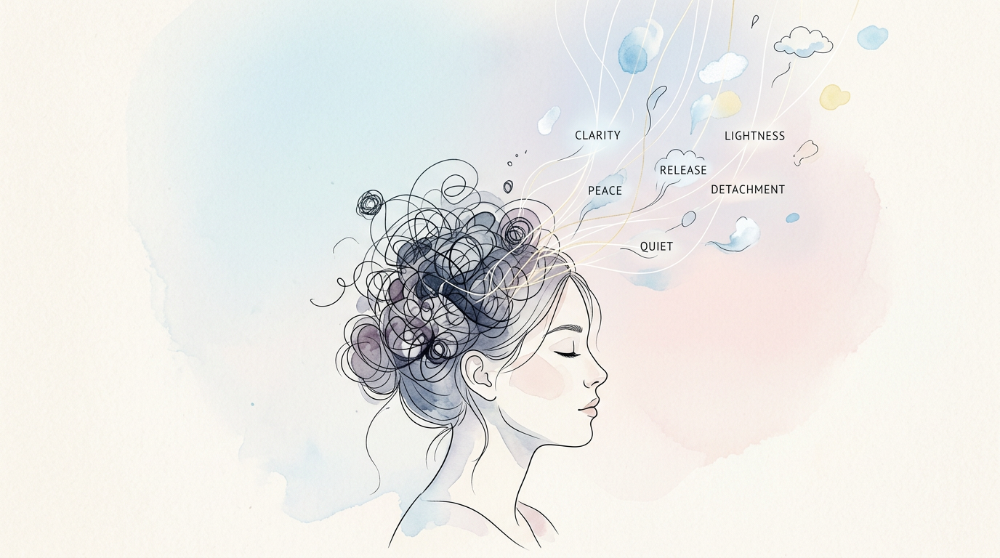

# 231《《幸福的陷阱：為什麼追求幸福反而造成痛苦？》》

> 幸福不是被找到的，而是被接受的。

這句話聽起來有點像廢話對吧 !? 

但讀這本書的時候， 我發現自己過去追求幸福的方式， 根本是在挖洞把自己埋進去。

瑞思·哈里斯在《幸福的陷阱》裡說了一件讓我很不舒服的事：我們越努力追求幸福， 往往越痛苦。

## 我們都掉進了同一個坑

開心很重要對吧!? 追求快樂跟幸福也很理所當然，但往往這些追求來的快樂都顯得表面、短暫。

反而是不開心、不爽、難過在生活中顯得很大，幾乎無法被忽略。

從小到大， 我們被教導要「正向思考」、「保持樂觀」、「趕走負面情緒」。 

彷彿人生的目標就是永遠處於一種開心愉悅的狀態。

但你有沒有想過， 這件事本身就很奇怪？

書裡提到一個概念叫「控制的議題」。 

我們以為情緒是可以被控制的， 就像調整冷氣溫度一樣。 

但事實是， 越想壓下去的念頭， 越會跑出來。

### 叫你不要想白熊， 你腦袋裡第一個跑出來的就是白熊。

創業那幾年， 每次遇到低潮的時候， 我都會跟自己說「想開一點」、「不要這麼負面」。 

> 結果呢？ 越想越糟。 

因為在「不要負面」的同時， 我其實是在不斷提醒自己正處於負面的狀態。

## ACT 不是要你變快樂

這本書的核心是 ACT（接受與承諾療法）。 

一開始看到「療法」兩個字我有點退縮， 想說這該不會是那種要我每天對著鏡子說「我愛我自己」的東西吧 ?

結果完全不是。

ACT 的重點是：別再跟你的情緒打架了。 

接受它存在， 然後把注意力放到你真正在乎的事情上。

### 痛苦本身不是問題， 對抗痛苦才是問題。

讀到這段的時候， 我想到《被討厭的勇氣》。 

阿德勒說的「課題分離」跟這裡講的其實有點像—— 有些事情你控制不了， 硬要控制只會讓你更痛苦。

> 情緒就像天氣，你沒辦法決定今天下不下雨，但你可以決定要不要帶傘出門。

而這個核心，基本上也與冥想的核心一致。 

讓念頭飄過去，接受它存在，然後回到當下的呼吸，跟自己在當下的存在。

## 認知脫鉤這件事

書裡有個技巧叫 Defusion， 中文翻成「認知脫鉤」。 

聽起來很玄， 但其實概念很簡單。

當你腦袋裡跑出「我是個失敗者」這個念頭時， 不要急著否認它、也不要被它吞噬。 

你只要加一句前綴：「我注意到我正在想『我是個失敗者』這件事。」

> 就這樣。 只是加個標籤給念頭。

### 念頭是念頭，你是你。

這招我實際試過幾次。 

一開始覺得很蠢。 

但神奇的是， 當你把自己跟那個想法拉開一點距離， 它的殺傷力就沒那麼大了。

以前做產品的時候， 用戶的負評會讓我整天心情很差。 

這很難免，就像你的孩子被罵廢物一樣，你很難不想到自己是不是可以做得更好。

但現在我會跟自己說：「我注意到我正在因為這則評論感到挫折。」 

然後就⋯ 好一點了。 

不是假裝沒事那種好， 是真的可以繼續做該做的事。

## 價值觀才是你的 North Star

書的後半段花很多篇幅談「價值觀」。 不是那種掛在牆上的 Mission Statement， 而是問你一個很直接的問題：

### 如果痛苦不會消失，你還願意為了什麼繼續走下去？

這個問題打到我。

創業的時候常常會問自己「這樣做值得嗎」、「什麼時候才會輕鬆一點」。 但這本書讓我換了個角度想—— 也許根本不會輕鬆。 重點是那件讓你甘願不輕鬆的事情，到底是什麼。

價值觀不是目標。 目標可以達成、可以打勾。 但價值觀是一個方向， 你永遠在走， 永遠不會「完成」。

這讓我想起當初為什麼開始寫東西。 不是為了流量、不是為了變現， 而是「想把自己學到的事情分享出去」這個很單純的念頭。 那就是一種價值觀。

## 幸福是副產品

最後這本書給我的最大收穫， 是重新定義了什麼叫「活得好」。

活得好不是每天都很開心。 

活得好是你知道自己在乎什麼， 然後願意帶著那些不舒服的情緒， 繼續往那個方向走。

### 幸福不是目的地，是你走在對的路上時偶爾出現的風景。

說真的， 讀完這本書不會讓你變快樂。 

但它可能會讓你不再那麼執著於「要變快樂」這件事。

而那個放下， 本身就是一種解脫。

---

📚 **書籍資訊**

- 書名：《幸福的陷阱：為什麼追求幸福反而造成痛苦？》
- 作者：瑞思·哈里斯
- 核心主題：停止對抗負面情緒，用接受與承諾的方式活出有意義的人生

---