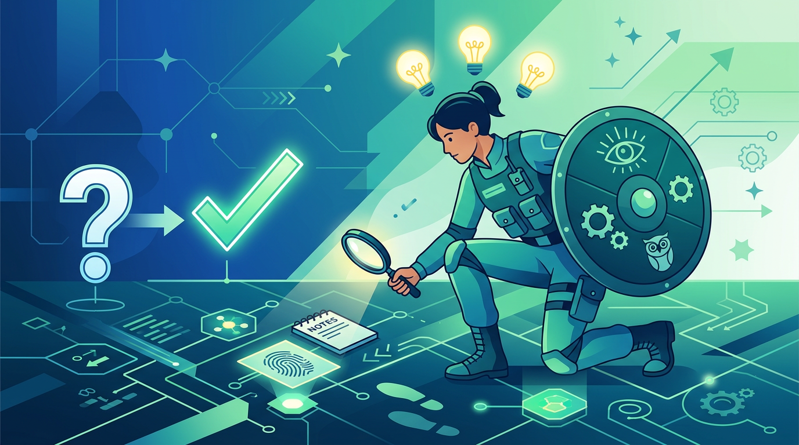

# 《騙局：為什麼聰明人容易上當？》

> 「聰明人不會上當。」

這大概是我們從小到大最常聽到的假設之一。 

但如果你真的這樣想，那你可能就是下一個目標。

瑪莉亞・柯妮可娃在《騙局：為什麼聰明人容易上當？》裡面說的第一件事，就打臉了這個假設。 

她說，騙子最愛的獵物，往往就是那些自認為「不可能被騙」的人。

---

## 自信是一種漏洞

讀到這段的時候，我想到的是之前震驚全球的「惡血（Theranos）」騙局。

創辦人伊莉莎白·霍姆斯（Elizabeth Holmes）靠著一台根本驗不出正確結果的血液檢測儀器，騙過了無數政商名流，包含美國前國務卿、傳媒大亨，甚至頂尖的創投基金。

這些投資人難道不聰明嗎？他們絕頂聰明。但有些最聰明的人，反而在最基本的地方栽跟頭。

不是因為他們笨，而是因為他們太相信自己的判斷力，也太渴望參與一個「改變世界」的偉大願景。

書裡提到一個概念叫「過度自信偏差（Overconfidence bias）」。 

簡單說就是，當我們越覺得自己懂、越覺得自己不會犯那種低級錯誤的時候，我們的防線反而是最鬆的。

騙子不會去騙一個隨時保持警覺的人。 

他們會去找那個覺得「這種事不會發生在我身上」的人。

### 真正的風險不是遇到騙子，而是你不相信自己會被騙。

---

## 情緒才是真正的開關

柯妮可娃在書裡花了很大的篇幅講一件事：大部分的騙局都不是靠邏輯說服你的。 

> 它們靠的是情緒。

貪婪、恐懼、時間壓力、社會認同。 

這四個東西組合起來，基本上可以讓任何人的理性判斷力暫時當機。

我記得以前看過一個朋友差點被投資詐騙套住。 

他是工程師背景，邏輯能力超強。但當對方用「限時優惠」加上「其他幾個知名人士都投了」這兩招組合技的時候，他的腦袋就短路了。

### 邏輯很強的人不是不會被騙，只是需要用不同的方式被騙。

書裡有一段話讓我印象很深：

> 騙子不需要你相信他說的是真的。他只需要你在那個當下，來不及想清楚。

這讓我想起在《快思慢想》裡講的系統一（直覺反應）跟系統二（理性思考）。騙局的本質，就是讓你的理性思考來不及啟動，讓直覺先衝出來做決定。

同樣的邏輯，如果應用在產品的收費機制上，往往也是相當有效的手段。

看看那些要課金的手機遊戲就知道了，就算理智告訴自己要忍住，但在「限時超值禮包」加上「全服廣播別人抽到大獎」的雙重刺激下，還是很容易腦波一弱就刷下去了。

---

## 為什麼「報酬率」是最大的紅旗

書裡有一章專門在講龐氏騙局跟各種投資詐騙。柯妮可娃說了一句很直白的話：

### 當報酬率高到不合理的時候，唯一合理的解釋就是它不是真的。

這聽起來像廢話對吧？ 

但你看看每隔幾年就會爆出來的那些吸金案。受害者裡面有醫生、律師、教授、成功企業家。這些人絕對不是笨蛋。

問題在於，當你看到身邊的人都在賺錢、當你親眼看到有人真的拿到報酬的時候，你的腦袋會開始合理化。 

「也許這次不一樣」、「也許這個產業真的有這種利潤」。

柯妮可娃說這叫「動機性推理（Motivated reasoning）」。 

你先有了「我想要相信」的動機，然後你的腦袋會自動幫你找理由。

這不是智商問題。這是人性。

---

## 社會證明是最強的武器

我在帶團隊的時候學到一件事：人不太會被數據說服，但很容易被「別人也這樣做」說服。

書裡講的也是這件事。騙子最常用的招數之一，就是讓你看到「其他人都相信了」。 

名人代言、成功見證、朋友推薦。這些東西的說服力遠大於任何邏輯論證。

> 我們不是在判斷事情是不是真的。我們是在觀察別人相不相信。

這讓我想起以前在創業圈看到的募資場景。有時候一個案子能不能拿到錢，不是取決於商業模式好不好，而是取決於「誰已經投了」。 

社會認同（Social proof）的力量太強了。

### 當大家都在往下跳的時候，停下來問「為什麼」是最難的事。

---

## 那要怎麼辦？

讀完這本書之後，我沒有變得更會識破騙局。但我變得更不相信自己「不會被騙」這件事。

柯妮可娃給的建議很實際：

1. **給自己時間**：任何需要你「馬上決定」的事情，都值得懷疑。
2. **找一個不相干的人聊聊**：當你深陷其中的時候，局外人往往看得更清楚。
3. **問自己一個問題**：「如果這是假的，我會怎麼知道？」如果你找不到任何可以驗證的方式，那就是一個警訊。

這些聽起來都很基本。但基本的東西往往最難在關鍵時刻做到。

### 防止被騙的第一步，是接受自己可能會被騙。

---

> 騙子利用的從來不是我們的愚蠢，而是我們的人性。
>
> 承認自己的脆弱，往往是建立最強防線的第一步。

---

📚 **書籍資訊**

- 書名：《騙局：為什麼聰明人容易上當？》（The Confidence Game）
- 作者：瑪莉亞・柯妮可娃 (Maria Konnikova)
- 核心主題：拆解人類決策盲點與騙局運作的心理機制