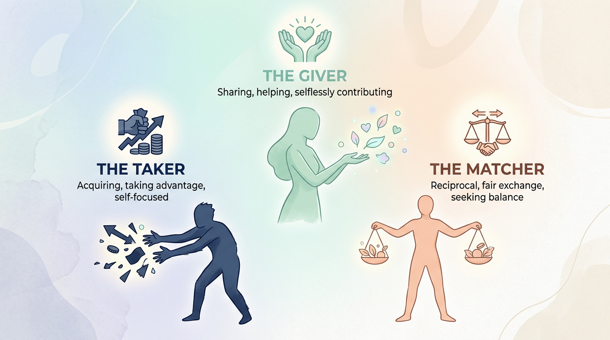
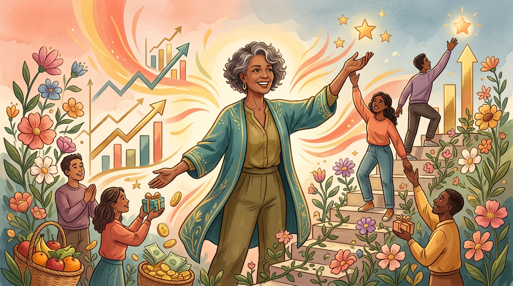
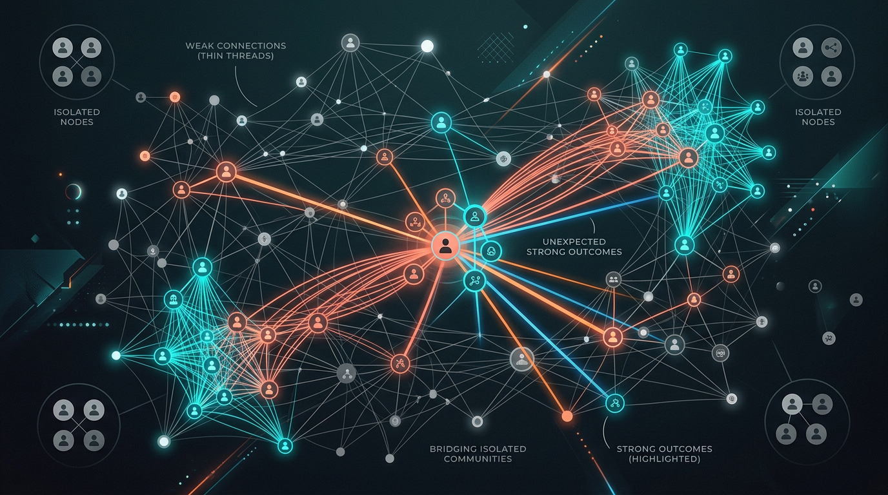
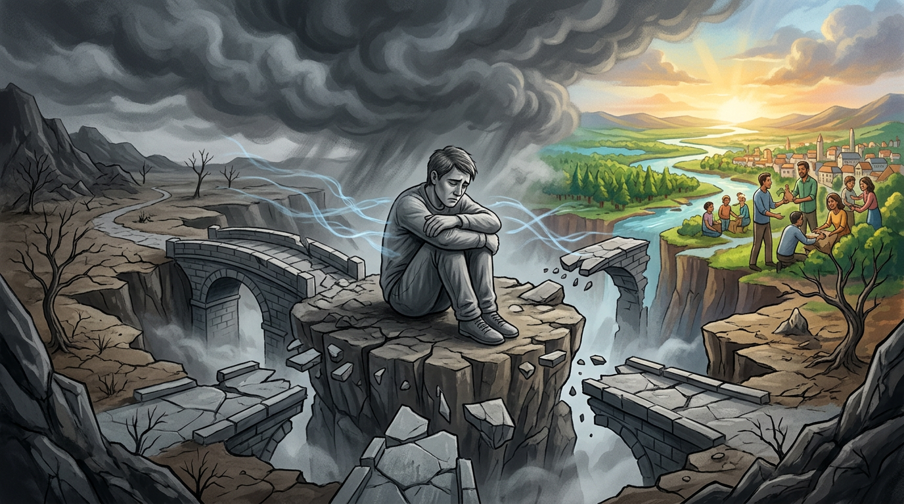
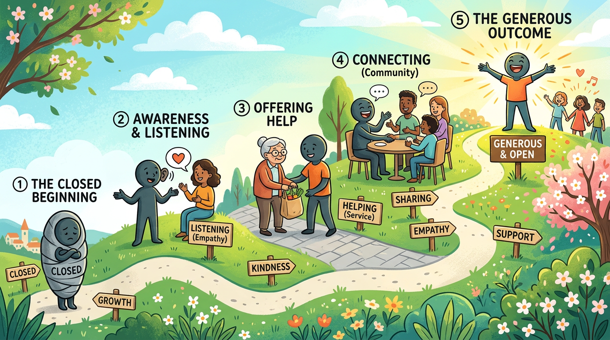

# 《給予：推動他人卓越的隱藏力量》

> "The most meaningful way to succeed is to help others succeed."
> （讓自己成功最有意義的方式，就是幫助別人成功。）

這句話看起來很像老套的心靈雞湯，對吧？

但華頓商學院最年輕的終身教授亞當·格蘭特（Adam Grant），在《給予》這本書裡用了大量的科學研究和真實故事告訴我們：這不只是雞湯，而是一個經過驗證的成功策略。

讀這本書的時候，我一直在心裡默默問自己：「我到底是哪一種人？」

---

## 世界上有三種人

格蘭特把人分成三類：Giver（給予者）、Taker（索取者）、Matcher（互利者）。

**Giver** 是那種會主動幫助別人、不太計較回報的人。  
**Taker** 則是隨時想著怎麼從別人身上拿到好處、讓自己利益最大化。  
**Matcher** 介於中間，講究公平交換，你幫我一次，我才幫你一次。

有趣的是，數據顯示在職場成功金字塔的最底層和最頂層，居然都是 Giver。

### 最失敗的是 Giver，但最成功的也是 Giver。

這讓我想起以前團隊裡的一個夥伴。

他什麼忙都幫、什麼事都扛，結果自己的事情永遠做不完，最後累到離職。

當時我以為問題出在他「人太好、不懂拒絕」。

但讀完這本書我才明白，問題不在於「給予」本身，而在於「怎麼給」。

---

## 成功的 Giver 長什麼樣子

格蘭特提出了一個很棒的概念叫「利他且自利的人（Otherish Giver）」。

這種人跟一般 Giver 的差別在於：他們在幫助別人的同時，也會保護自己的利益和精力。

他們懂得設定界線，知道什麼時候該說不。

> 給予不是燃燒自己照亮別人，而是創造一種雙贏的互動模式。

書中提到一個很經典的例子：矽谷頂尖的「人脈王」亞當·雷夫金（Adam Rifkin）。

他就是一個標準的 Otherish Giver。

他奉行著名的「五分鐘法則」——只要這件事對別人的價值很高，而自己只需花不到五分鐘就能幫上忙（例如幫兩個需要認識彼此的人寫封 Email 牽線），他就會毫不猶豫地去做。

他不會無底線地把時間全部掏空給別人，但他透過這些高效率的「微小給予」，建立起了矽谷最龐大且深厚的互信網絡。

當他自己創業需要幫忙時，整個網絡都會動起來支持他。

這就是最完美的雙贏。

### 願意先付出的人，往往能建立起最深的信任。

我記得有一次見一個潛在的合作夥伴，第一次見面，他就把自己踩過的坑、走過的冤枉路全部跟我說了。

沒有藏私、沒有任何談判的防備。

那次之後我們就決定合作了。

不是因為條件開得多好，而是因為那種「先給予」的態度，讓人覺得這是一段可以信任的關係。

---

## 弱連結的力量

書裡還有一個我很喜歡的觀點：那些不太熟的人脈（弱連結 Weak ties），反而比好朋友（強連結）更能帶來新機會。

為什麼？因為你的好朋友知道的事情、認識的人，你大概也都認識。

但那些點頭之交、久沒聯絡的前同事、某個活動上換過名片的人，他們的世界跟你完全不同，能帶來跨同溫層的資訊。

### 最好的機會，往往來自你意想不到的人。

這或許會顛覆你對「經營人脈」的想像。

以前總覺得人脈就是要常常吃飯、拼命維持關係。但格蘭特的研究告訴我們，重點不是關係有多黏膩，而是你過去有沒有真心幫過對方。

那些你曾經順手推過一把的人，就算五年沒聯絡，他們心裡還是會記得這份情。

---

## Taker 的代價

書裡有一段讓我印象很深刻：在一個資訊高度透明的時代，Taker（索取者）的壞名聲傳得比什麼都快。

以前一個人的評價可能只在公司的小圈子裡流傳。

現在？一封群組訊息、一則 LinkedIn 的留言，你是什麼樣的人，大家很快就會知道。

> 聲譽是一種緩慢累積、卻能快速崩塌的資產。

書裡舉了安隆（Enron）公司前執行長肯尼斯·雷（Kenneth Lay）的著名案例。

他就是個極致的 Taker。

在面對上司、金主和有權勢的人時，他表現得像個完美的天使；但面對下屬時，他無情地榨取團隊的價值，甚至把別人的功勞全搶到自己頭上。

這種「對上諂媚、對下欺壓」的作法，短期內讓他爬到了權力巔峰。

但當安隆爆發財務危機時，那些曾經被他踩在腳下的人、被他利用過的團隊，沒有半個人願意挺他，甚至紛紛出來指證，最後他聲名狼藉，公司也走向毀滅。

### 短期來看 Taker 可能會贏，但長期來看他們一定輸。

---

## 怎麼開始成為一個更好的 Giver

讀完這本書，我問自己的問題不再是「我要不要當 Giver」，而是「我要怎麼當一個聰明的 Giver」。

這是我從書裡學到，可以立刻開始做的幾個原則：

1. **先從小事開始幫忙**：善用「五分鐘法則」，五分鐘能幫上忙的順手之勞就不要猶豫。
2. **學會說不**：特別是對那些只會一味索取（Take）的人，你要勇敢設立界線，保護自己的精力。
3. **集中給予的時間**：把幫助別人的時間集中在特定時段（比如每週五下午），而不是整天被打斷自己的工作節奏。
4. **尋找同路人**：找到那些也願意給予的人，形成一個互相幫忙、正向循環的小圈子。

這些聽起來都不難，但真的要在生活中落實，是需要刻意練習的。

我自己也還在學習的路上。

---

> 聰明的給予，不是犧牲自己，而是把餅做大。

---

📚 **書籍資訊**

- 書名：《給予：推動他人卓越的隱藏力量》（Give and Take）
- 作者：亞當·格蘭特（Adam Grant）
- 核心主題：為什麼願意先付出的人，反而能獲得最大的成功